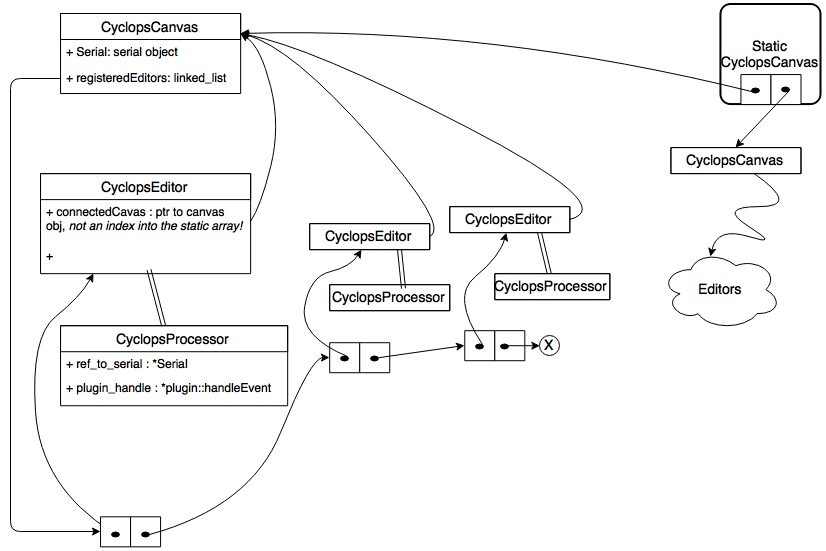

# Open Ephys Cyclops plugin Architecture
The class names and their members as well re-use the term "plugin". So, for enforcing a good naming convention, what do you think best suits as a replacement for the cyclops plugins (aka sub-plugins):

* pluglets, plugletManager, cyclops-pluglet
* subPlugin, subPluginManager, cyclops-sub-plugin
* Something even better?

##Notation (from here on..):
* plugin refers to Cyclops _sub-plugins_ unless specified otherwise.
* Things marked (beta) can be added without any change to _this_ architecture.

##Source Directory Structure
```
|-- CyclopsAPI
|   |-- CyclopsAPI.cpp
|   `-- CyclopsAPI.h
|-- CyclopsCanvas.cpp
|-- CyclopsCanvas.h
|-- CyclopsEditor.cpp
|-- CyclopsEditor.h
|-- CyclopsProcessor.cpp
|-- CyclopsProcessor.h
|-- Makefile
|-- OpenEphysLib.cpp
|-- plugin_manager
|   |-- CLPluginManager.cpp
|   |-- CLPluginManager.h
|   |-- CyclopsPlugin.cpp             <---- Important
|   |-- CyclopsPlugin.h               <---- Important
|   `-- CyclopsPluginInfo.h
`-- plugins
    `-- Example_CL_Plugin
        |-- CyclopsPluginInfo.cpp
        |-- Example_CL_Plugin.cpp
        |-- Example_CL_Plugin.h
        `-- Makefile
```

#Cyclops API
This is a self contained module that provides the interface to cyclops commands. The `CyclopsPlugin` exposes this API to the user-written plugin.
In reality, it _only_ converts function calls into `char` buffers that will be sent to the cyclops.
The actual sending is the responsibility of `CyclopsProcessor`.

Note that this module does not instantiate any resources (even on the serial port). All such resources are allocated in the GUI plugin code.

#plugin_manager
`CyclopsPlugin` is just a base class for all user plugins and described [here](#cyclopsplugin).

##`CyclopsPluginInfo`
Just like any OE plugin requires an `OpenEphysLib.cpp` which defines the "entry points" into the user-written plugin -- we require `CyclopsPluginInfo.cpp`.

##CLPluginManager
Loads all plugin libraries at runtime and makes a "map" of plugin name -> `CyclopsPluginInfo` structs.
This map is used to fill the combobox / "add plugin" button with plugins to choose from.

#plugins
This directory holds all user-made plugins. Each plugin must define it's entry-point in `CyclopsPluginInfo.cpp`.

#CyclopsPlugin
This (base) class keeps track of all "Source" objects that exist on the Cyclops. Not everything about the "Source" is available, but basic info is.
The pure virtual method `handleEvent` must be implemented by the (derived) user plugin. The user can invoke API calls and do event processing in general -- for ex., by including `SpikeObject`, s/he can unpack and analyse them.

User needs to decide how many sources are to be used, and how many cyclops LEDs are controlled by the plugin. (This info is filled in the `CyclopsPluginInfo.cpp`)

The plugin does not hardcode which _real physical_ LED channel it controls, the API too just provides a set of valid commands

Currently, this (base) class **does not provide the "data" channel to the user plugin**.
>Should it?

#GUI Implementation



##CyclopsCanvas
This owns a serial object. It has a static list of other instances of Canvases and serial objects.  
Also owns a linked list of _pointers_ to the editors which have been configured (aka connected) with this board. The list allows the canvas to affect the connected editors in many ways.  

##CyclopsEditor
Has a _pointer_ to the canvas it is configured with. The editor can be thought to act as a **hook in the pipeline** which fishes out events for the plugin selected in the canvas.

The editor does not know of which plugin it feeds, that's the processor's job. So the changes on canvas percolate down to the processor (atleast just before experiment launch).

Unlike a typical derivation of the `VisualizerEditor`, this editor does not _own_ the Canvas. The canvases are owned in a static `CyclopsCanvas::OwnedArray`. This is because many editors need to share the same canvas instance.
With some tweaking of the `VisualizerEditor` I've done this (though [there is a bug]() which requires major overhaul to resolve :) ).

##CyclopsProcessor
Does not own a serial object. Think of it as gluing OE event channels with a plugin. When the experiment is launched, all processors query their editors for many settings:

* A reference to the (shared -- _among plugins_) serial object.
* The real LED channels that are being controlled
* Any plugin parameters (beta)

